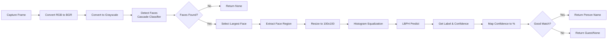
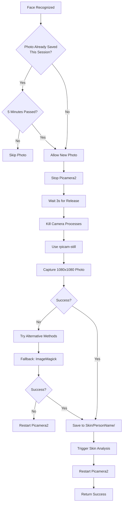
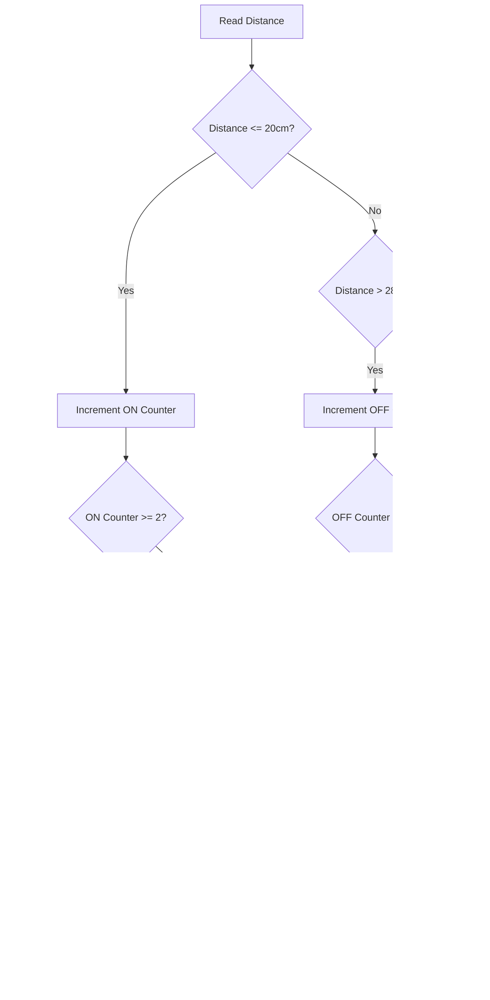
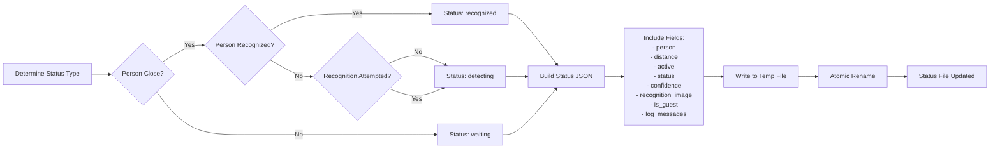
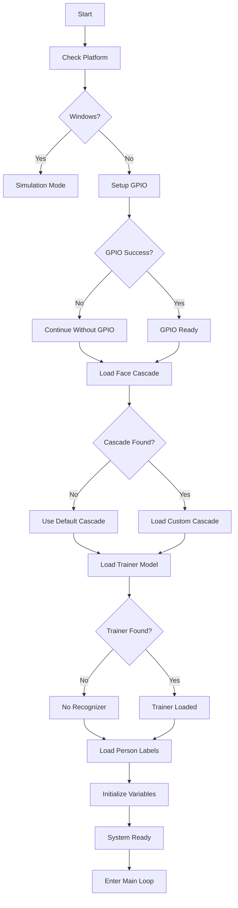
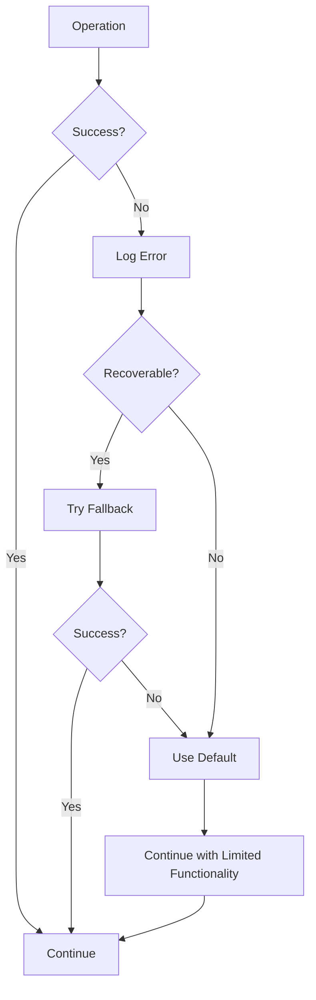

# 🔄 Face Recognition System Flowchart

Complete flowchart of the MagicMirror² Face Recognition System.

---

## 📊 Main System Flow

```mermaid
flowchart TD
    Start([System Start]) --> Init[Initialize System]
    Init --> GPIO[Setup GPIO Pins<br/>- Ultrasonic: 23, 24<br/>- Relay: 18]
    GPIO --> LoadCascade[Load Face Cascade<br/>haarcascade_frontalface_default.xml]
    LoadCascade --> LoadTrainer[Load Trainer Model<br/>trainer.yml]
    LoadTrainer --> LoadLabels[Load Person Labels<br/>from Images/ directory]
    LoadLabels --> InitCamera[Initialize Camera<br/>Picamera2]
    InitCamera --> MainLoop[Main Loop Start]
    
    MainLoop --> ReadDistance[Read Ultrasonic Distance<br/>Median Filter 3 samples]
    ReadDistance --> CheckDistance{Distance <= 20cm?}
    
    CheckDistance -->|No| Away[Person Away]
    Away --> CheckAwayCount{Away Count >= 4?}
    CheckAwayCount -->|No| MainLoop
    CheckAwayCount -->|Yes| TurnOffLights[Turn OFF Relay Lights]
    TurnOffLights --> ClearPerson[Clear Person State]
    ClearPerson --> StartTimeout[Start 5s Timeout Timer]
    StartTimeout --> CheckTimeout{Timeout Elapsed?}
    CheckTimeout -->|No| MainLoop
    CheckTimeout -->|Yes| FinalCleanup[Final Cleanup]
    FinalCleanup --> MainLoop
    
    CheckDistance -->|Yes| Close[Person Close]
    Close --> ControlLights[Control Lights Based on Distance<br/>Schmitt Trigger Logic]
    ControlLights --> CheckProximityCount{Proximity Stable >= 3?}
    CheckProximityCount -->|No| MainLoop
    CheckProximityCount -->|Yes| Activate[Activate Face Recognition]
    Activate --> ResetState[Reset Recognition State]
    ResetState --> CheckRecognition{Recognition Attempted?}
    
    CheckRecognition -->|No| WaitDelay{Wait 0.3s?}
    WaitDelay -->|No| MainLoop
    WaitDelay -->|Yes| StartRecognition[Start Face Recognition]
    StartRecognition --> CaptureFrame[Capture Camera Frame]
    CaptureFrame --> DetectFaces[Detect Faces with Cascade]
    DetectFaces --> CheckFaces{Face Detected?}
    
    CheckFaces -->|No| NoFace[No Face Detected]
    NoFace --> LockRecognition[Lock Recognition]
    LockRecognition --> UpdateStatus[Update Status File]
    UpdateStatus --> MainLoop
    
    CheckFaces -->|Yes| ProcessFace[Process Largest Face<br/>Resize to 100x100<br/>Histogram Equalization]
    ProcessFace --> CheckRecognizer{Recognizer Available?}
    
    CheckRecognizer -->|No| NoRecognizer[No Recognizer]
    NoRecognizer --> HandleGuest[Handle as Guest<br/>Generate Guest Name]
    HandleGuest --> SaveGuestPhoto[Save Guest Skin Photo]
    SaveGuestPhoto --> UpdateStatus
    UpdateStatus --> MainLoop
    
    CheckRecognizer -->|Yes| PredictFace[Predict Face<br/>LBPH Recognizer]
    PredictFace --> CalculateConfidence[Calculate Confidence %<br/>Map LBPH to 0-100%]
    CalculateConfidence --> CheckConfidence{Confidence < 90<br/>AND<br/>Percent > 70%?}
    
    CheckConfidence -->|No| LowConfidence[Low Confidence Match]
    LowConfidence --> IncrementUnknown{Unknown Attempts < 2?}
    IncrementUnknown -->|Yes| MainLoop
    IncrementUnknown -->|No| HandleGuest
    
    CheckConfidence -->|Yes| Recognized[Face Recognized!]
    Recognized --> CopySkinPhoto[Copy Latest Skin Photo<br/>to Recognition Image]
    CopySkinPhoto --> SaveSkinPhoto[Save High-Res Skin Photo<br/>rpicam-still 1080x1080]
    SaveSkinPhoto --> TriggerAnalysis[Trigger Skin Analysis]
    TriggerAnalysis --> TurnOnLights[Turn ON Relay Lights]
    TurnOnLights --> LockRecognition[Lock Recognition]
    LockRecognition --> UpdateStatus[Update Status File<br/>with Person, Confidence, Image]
    UpdateStatus --> MainLoop
    
    style Start fill:#90EE90
    style Recognized fill:#FFD700
    style HandleGuest fill:#FFA500
    style TurnOffLights fill:#87CEEB
    style TurnOnLights fill:#FFD700
```



---

## 🔍 Detailed Sub-Processes

### 1. Face Recognition Process



### 2. Skin Photo Capture Process



### 3. Relay Control Logic



### 4. Status File Update Flow



### 5. System Initialization Flow



---

## 📋 Key Decision Points

### Proximity Detection
- **Threshold**: 20cm
- **Stability**: Requires 3 consecutive readings
- **Away Detection**: Requires 4 consecutive readings

### Face Recognition
- **Confidence Threshold**: < 90 (LBPH) AND > 70% (mapped)
- **Unknown Attempts**: 2 attempts before assigning guest
- **Sticky Identity**: Maintains recognition for 8 seconds

### Relay Control
- **ON Threshold**: ≤ 20cm (2 stable readings)
- **OFF Threshold**: > 28cm (5 stable readings)
- **Debounce**: 2 second block timer

### Photo Capture
- **Interval**: 5 minutes minimum between photos
- **Resolution**: 1080x1080
- **Method**: rpicam-still (primary), ImageMagick (fallback)

---

## 🔄 State Machine

```
┌─────────────┐
│   WAITING   │ ← No person detected
└──────┬──────┘
       │ Distance < 20cm
       ▼
┌─────────────┐
│  DETECTING  │ ← Person close, recognizing
└──────┬──────┘
       │ Face recognized
       ▼
┌─────────────┐
│ RECOGNIZED  │ ← Person identified
└──────┬──────┘
       │ Distance > 20cm
       ▼
┌─────────────┐
│   TIMEOUT   │ ← 5 second countdown
└──────┬──────┘
       │ Timeout elapsed
       ▼
┌─────────────┐
│   WAITING   │
└─────────────┘
```

---

## 📝 Data Flow

```
┌─────────────────┐
│ Ultrasonic      │
│ Sensor (GPIO)   │──┐
└─────────────────┘  │
                     │
┌─────────────────┐  │
│ Camera          │──┤
│ (Picamera2)     │  │
└─────────────────┘  │
                     │
                     ▼
         ┌───────────────────┐
         │ face_recognition  │
         │ _system.py        │
         └─────────┬─────────┘
                   │
         ┌─────────▼─────────┐
         │ Status File       │
         │ /tmp/magicmirror_ │
         │ face_status.json  │
         └─────────┬─────────┘
                   │
         ┌─────────▼─────────┐
         │ Node Helper       │
         │ (facerecognition) │
         └─────────┬─────────┘
                   │
         ┌─────────▼─────────┐
         │ Frontend Module   │
         │ (facerecognition) │
         └───────────────────┘
```

---

## 🎯 Main Loop Pseudocode

```
WHILE True:
    distance = get_distance()  # Median filtered
    control_lights(distance)
    
    IF distance <= 20cm:
        proximity_count++
        IF proximity_count >= 3 AND NOT active:
            activate_face_recognition()
        
        IF active AND person IS None AND NOT recognition_attempted:
            IF wait_time >= 0.3s:
                person = recognize_face()
                IF person:
                    save_skin_photo(person)
                    turn_on_lights()
                    lock_recognition()
        
        update_status_file()
        sleep(0.2s)
    ELSE:
        away_count++
        IF away_count >= 4:
            turn_off_lights()
            clear_person()
            start_timeout()
        
        IF timeout_elapsed:
            final_cleanup()
        
        update_status_file()
        sleep(0.3s)
```

---

## 🔧 Error Handling Flow



---

## 📊 Performance Optimizations

1. **Distance Smoothing**: Median filter (3 samples) + averaging
2. **Status Updates**: Throttled to 0.5s intervals
3. **Camera Reuse**: Single camera instance, not recreated
4. **Recognition Lock**: Prevents repeated attempts
5. **Relay Debouncing**: 2s block timer prevents flickering
6. **Photo Interval**: 5 minute minimum between captures

---

This flowchart represents the complete system architecture and data flow of the Face Recognition System.

